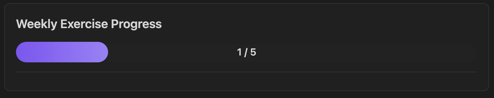
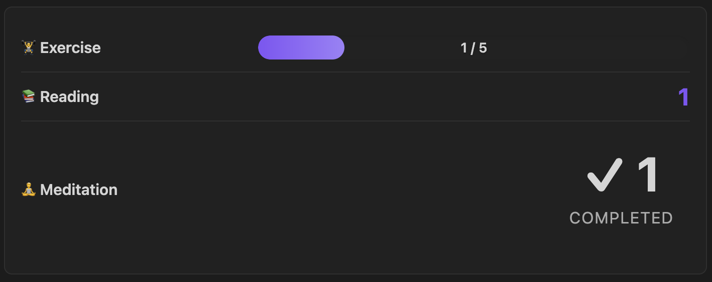
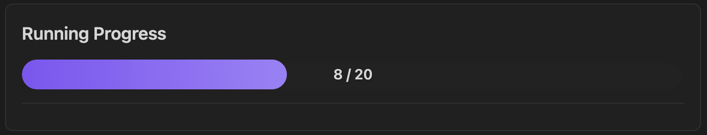

# Habit Progress Tracker

Track habits and visualize progress across your Obsidian vault with customizable progress bars, counters, and more.

<!-- Hero image placeholder -->
<p align="center">
	
</p>

## Features

- 📊 **Multiple Visualizations**: Progress bars, counters, percentages, streaks, line plots
- 📁 **Flexible Sources**: Current file, specific file, or entire folder
- 📋 **Table Support**: Extract data from markdown tables
- 🏷️ **Table Tagging**: Filter which tables to scan using HTML comments
- 🎯 **Dynamic Goals**: Extract goals from table columns
- 📅 **Time Periods**: Daily, weekly, monthly, yearly, or all-time tracking
- 🎨 **Layout Options**: Grid or compact-list for multi-widget dashboards
- ➕ **Aggregation**: Count, sum, average, min, max

## Installation

### Manual Installation

1. Download `main.js`, `manifest.json`, and `styles.css` from releases
2. Create folder: `<vault>/.obsidian/plugins/habit-progress-tracker/`
3. Copy files into that folder
4. Reload Obsidian and enable the plugin

### From Source

```bash
cd <vault>/.obsidian/plugins/
git clone <repo-url> habit-progress-tracker
cd habit-progress-tracker
npm install
npm run build
```

## Quick Start

### Simple Table Tracker

Track exercise from a table in the current file:

```markdown
<!-- table-tag: weekly -->
| Activity | Done |
|----------|------|
| Exercise | ✓    |
| Reading  | ✓    |
```

````progress-tracker
type: progress_bar
source: current-file
tableTag: weekly
keyColumn: Activity
key: Exercise
valueColumn: Done
value: "✓"
goal: 5
label: Weekly Exercise
````



### Multi-Widget Dashboard

Multiple trackers in one block with compact layout:

````progress-tracker
layout: compact-list
source: current-file
tableTag: weekly

type: progress_bar
keyColumn: Activity
key: Exercise
valueColumn: Done
value: "✓"
goal: 5
label: 🏋️ Exercise

---

type: counter
keyColumn: Activity
key: Reading
valueColumn: Done
value: "✓"
label: 📚 Reading

---

type: counter
keyColumn: Activity
key: Meditation
valueColumn: Done
value: "✓"
label: 🧘 Meditation
````



## Source Types

### Current File

Scan tables in the file containing the tracker block:

````progress-tracker
type: progress_bar
source: current-file
keyColumn: Activity
key: Exercise
valueColumn: Done
value: "✓"
label: Exercise Progress
````

### Specific File

Scan tables in a specific file (useful for dashboards):

````progress-tracker
type: progress_bar
source: file:Trackers/Monthly Habits.md
keyColumn: Activity
key: Exercise
valueColumn: Done
value: "✓"
goal: 20
label: Monthly Exercise
````

### Folder (Pattern Mode)

Scan multiple files in a folder, counting text pattern occurrences:

````progress-tracker
type: streak
source: folder:Daily Notes
pattern: "- [x] Meditation"
period: monthly
label: Meditation Streak
````

**Note:** For folder mode, filenames should include dates in `YYYY-MM-DD` format for period filtering and streak calculation.

## Table Mode

### Basic Structure

Tables require a **key column** (to identify rows) and a **value column** (to extract data):

```markdown
| Activity | Done |
|----------|------|
| Exercise | ✓    |
| Reading  | ✓    |
```

````progress-tracker
type: counter
source: current-file
keyColumn: Activity
key: Exercise
valueColumn: Done
value: "✓"
label: Exercise Count
````

### Table Tagging

Filter which tables to scan using HTML comment tags:

```markdown
<!-- table-tag: weekly -->
| Activity | Done |
|----------|------|
| Exercise | ✓    |

<!-- table-tag: monthly -->
| Activity | Done |
|----------|------|
| Project  | ✓    |
```

````progress-tracker
type: counter
source: current-file
tableTag: weekly
keyColumn: Activity
key: Exercise
valueColumn: Done
value: "✓"
label: Weekly Exercise
````

### Value Types

**Text matching** - count cells containing specific text:
```yaml
value: "✓"          # Match checkmark
value: "done"       # Match "done"
value: "yes"        # Match "yes"
```

**Numeric** - extract and aggregate numbers:
```yaml
value: numeric
aggregate: sum      # Sum all numbers
```

**Any** - count any non-empty cell:
```yaml
value: any
```

### Numeric Values

Sum numeric values from a table:

```markdown
<!-- table-tag: reps -->
| Activity | Reps |
|----------|------|
| Pushups  | 25   |
| Situps   | 30   |
```

````progress-tracker
type: counter
source: current-file
tableTag: reps
keyColumn: Activity
key: Pushups
valueColumn: Reps
value: numeric
aggregate: sum
label: Total Pushups
````

### Dynamic Goals

Extract goals from a table column:

```markdown
<!-- table-tag: goals -->
| Activity | Current | Goal |
|----------|---------|------|
| Running  | 8       | 20   |
```

````progress-tracker
type: progress_bar
source: current-file
tableTag: goals
keyColumn: Activity
key: Running
valueColumn: Current
value: numeric
aggregate: sum
goalColumn: Goal
label: Running Progress
````



## Visualization Types

| Type | Description | Best For |
|------|-------------|----------|
| `progress_bar` | Visual bar showing progress toward goal | Goal tracking |
| `counter` | Simple count display | Totals |
| `percentage` | Percentage of goal completed | Completion rates |
| `streak` | Consecutive days (folder mode) or count | Habit streaks |
| `line_plot` | Trend chart over time (folder mode) | Trends |

## Layouts

### Grid Layout (Default)

````progress-tracker
layout: grid
gridColumns: 2

type: progress_bar
...
---
type: counter
...
````

### Compact List

````progress-tracker
layout: compact-list

type: progress_bar
...
---
type: progress_bar
...
````

## Configuration Reference

### Required Parameters

| Parameter | Description |
|-----------|-------------|
| `type` | Visualization: `progress_bar`, `counter`, `percentage`, `streak`, `line_plot` |
| `source` | Where to scan: `current-file`, `file:<path>`, or `folder:<path>` |

### Table Mode Parameters

| Parameter | Required | Description |
|-----------|----------|-------------|
| `keyColumn` | ✅ | Column containing row identifiers |
| `valueColumn` | ✅ | Column to read values from |
| `value` | ✅ | What to match: `numeric`, `any`, or exact text like `"✓"` |
| `key` | ❌ | Filter to rows containing this value in keyColumn |
| `tableTag` | ❌ | Filter to tables with this HTML comment tag |
| `goalColumn` | ❌ | Column to extract dynamic goal from |
| `aggregate` | ❌ | How to combine values: `count` (default), `sum`, `average`, `max`, `min` |

### Pattern Mode Parameters

| Parameter | Required | Description |
|-----------|----------|-------------|
| `pattern` | ✅ | Text to search for in file content |
| `useRegex` | ❌ | Enable regex matching (default: false) |

### Common Optional Parameters

| Parameter | Description |
|-----------|-------------|
| `goal` | Static goal number |
| `label` | Display label |
| `period` | Time filter (folder mode): `daily`, `weekly`, `monthly`, `yearly`, `all-time` |

### Block-Level Parameters

Apply to entire dashboard (before first `type:`):

| Parameter | Description |
|-----------|-------------|
| `layout` | `grid` (default) or `compact-list` |
| `gridColumns` | Number of columns for grid layout |
| `source` | Default source for all widgets |
| `tableTag` | Default table tag for all widgets |

## Examples

See [`examples/widget-screenshot-demo.md`](examples/widget-screenshot-demo.md) for ready-to-use templates.

## Troubleshooting

**Tracker shows 0:**
- Verify `keyColumn` matches your table header exactly (case-insensitive)
- Check that `key` value exists in your table
- For `tableTag`: ensure the HTML comment is above the table
- Check `value` matches what's in your cells

**Streak shows 0:**
- Streaks require folder mode with date-named files (YYYY-MM-DD)
- For current-file mode, streak shows the count instead

**Doesn't update:**
- Trackers update on file save
- Reload Obsidian (Cmd+R / Ctrl+R) if stuck

**Period filtering not working:**
- Only works with `source: folder:...`
- Filenames must include dates in YYYY-MM-DD format

## Development

```bash
npm install
npm run dev          # Watch mode
npm run build        # Production
npm test             # Run tests
```

## License

MIT License - see [LICENSE](LICENSE) file for details.

---